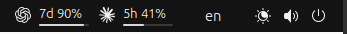

# CodexBar for GNOME — maintained fork

This is [OshriFatkiev’s maintained fork](https://github.com/OshriFatkiev/codexbar-gnome) of [InledGroup’s CodexBar GNOME extension](https://github.com/InledGroup/codexbar-gnome). It shows AI provider quotas in the GNOME panel, using the [CodexBar CLI](https://github.com/steipete/CodexBar) for most provider connections and built-in fetchers for direct Codex and Ollama connections.

The extension is still named **CodexBar**. This fork is maintained independently; report problems with this version in [this repository’s issues](https://github.com/OshriFatkiev/codexbar-gnome/issues).



## What this fork adds

- Separate provider logos and quota bars, equal bar widths, and compact spacing. Show all providers or the selected provider’s windows.
- Remaining or used quota display, with an exhausted window kept visible even when another window has quota left.
- Local reset times such as `◷ 14:30`, `◷ Fri 14:30`, or `◷ Sep 15 14:30` when a limit is fully exhausted. The desktop’s 12/24-hour preference is respected.
- Reorderable providers, collapsed provider settings, and provider-specific connection choices that preserve custom commands and visibly flag unsupported saved choices.
- Refresh handling that keeps results attached to the correct provider when settings change. Structured CLI responses avoid a second call for label discovery.
- Antigravity offline recovery, preserved fallback quotas, and a concise error when live quotas remain unavailable.
- A validated installer that backs up the previous installation and preserves settings.

Reset labels redraw locally once a minute without extra provider requests. When two displayed windows are exhausted, compact mode shows the later reset; if either blocking reset is unknown, it keeps the percentage. After a deadline passes, the percentage returns until a regular provider refresh confirms new quota. Credits and cost budgets continue to use percentages.

## Install this fork

**`main` is the recommended branch to install.** `integration` contains combined changes awaiting verification. Individual feature branches may contain experiments.

You need an existing GNOME Shell desktop and these commands: `git`, `gnome-extensions`, `glib-compile-schemas`, and `unzip`. This fork has been tested locally on **GNOME Shell 46.0**. Metadata declares compatibility with Shell 45–51; that is not a claim that every declared version has been tested here.

Run in a terminal inside your desktop session, without `sudo`:

```bash
git clone --branch main https://github.com/OshriFatkiev/codexbar-gnome.git &&
cd codexbar-gnome &&
./install.sh
```

Then load the new code:

- **X11:** press **Alt+F2**, type **`r`**, and press **Enter**.
- **Wayland:** log out and log back in.

The installer builds and checks a fresh ZIP before replacing the extension. It saves the previous files under `${XDG_STATE_HOME:-~/.local/state}/codexbar/install-backups/` and prints the exact backup path. If replacement fails, it restores those files and preserves the partial installation for diagnosis. If enabling fails, the new files remain installed; follow the printed reload and enable instructions.

### Existing installations and updates

From your existing checkout, including one previously installed from `integration`:

```bash
git switch main &&
git pull --ff-only origin main &&
./install.sh
```

Reload the session as described above. Your provider configuration and credentials are preserved; there is no need to configure providers again. If Git reports local changes or divergent history, resolve that before rerunning the update instead of discarding work.

This fork deliberately retains UUID `codexbar@inled.es` and the existing settings schema. It **replaces the upstream extension in the same installation slot**; the two versions cannot be enabled side by side. The [GNOME Extensions store listing](https://extensions.gnome.org/extension/9841/codexbar/) distributes the upstream version, not this fork. Use this checkout’s installer for fork updates.

### CodexBar CLI and optional helpers

Install the [CodexBar CLI](https://github.com/steipete/CodexBar) for CLI-backed connections, including the CLI’s OAuth sources. This transition does not remove that dependency or change provider authentication. The current onboarding still prompts for the CLI; direct Codex and Ollama fetchers are also available.

If you use Homebrew:

```bash
brew install steipete/tap/codexbar
```

Otherwise, follow the CLI project’s [installation documentation](https://github.com/steipete/CodexBar#readme) and [release downloads](https://github.com/steipete/CodexBar/releases). The extension looks for `codexbar` in common locations; you can also configure an absolute command path.

The optional helpers below come from this fork’s `main` and retain their upstream behavior. They are not required for every connection mode.

**Cookie importer:** for extracting browser cookies for the direct Codex connection. It uses `secret-tool`, `openssl`, and `sqlite3` and does not require PyPI.

```bash
mkdir -p ~/.local/bin &&
curl -fsSL https://raw.githubusercontent.com/OshriFatkiev/codexbar-gnome/main/scripts/codexbar-cookie-importer -o ~/.local/bin/codexbar-cookie-importer &&
chmod +x ~/.local/bin/codexbar-cookie-importer
```

**Antigravity certificate helper:** for connections that need to trust the local Antigravity server certificate. Running it changes system certificate trust and requests elevated privileges. Install it with:

```bash
mkdir -p ~/.local/bin &&
curl -fsSL https://raw.githubusercontent.com/OshriFatkiev/codexbar-gnome/main/scripts/codexbar-ssl-helper -o ~/.local/bin/codexbar-ssl-helper &&
chmod +x ~/.local/bin/codexbar-ssl-helper
```

When this trust setup is needed, run `codexbar-ssl-helper` and follow its prompts.

## Configuration and troubleshooting

Open the extension’s preferences to select providers, connection modes, display mode, and refresh interval. Provider-specific notes follow.

### Provider Commands

For CLI connections, the provider command must return JSON output. Direct API connections use the extension’s built-in fetchers.

Structured quota responses use a single CLI call per refresh when their labels
can be derived from JSON. Legacy responses still use a second text-mode call
when needed to discover labels. This does not change provider connections or
add automatic retries for other providers.

For Gemini usage through Antigravity (`agy`), enable **Antigravity** and choose
**Auto**. Run `agy` once and complete sign-in first:

```bash
codexbar --provider antigravity --source auto --format json
```

CodexBar can launch its own `agy` process or reuse a running one to read quota.
If the panel shows a dash, check the Antigravity section in the dropdown.
The extension retries an offline response once after a short delay. If that
also returns offline, the dropdown explains that live quotas are unavailable.
Valid primary and secondary quotas remain visible when additional quota windows
are absent or empty.
Open `agy`, let it finish signing in, and refresh. A successful terminal login
does not guarantee that CodexBar can read the quota service; persistent offline
responses require further diagnosis rather than repeated sign-ins.
A CLI response with `source: "offline"` and `usageKnown: false` contains local
history, not known quota; it cannot supply a usage percentage. Explicit OAuth
uses separate credentials and does not use the signed-in local `agy` service.
See [CodexBar's Antigravity documentation](https://github.com/steipete/CodexBar/blob/main/docs/antigravity.md).

**Gemini CLI** remains available for supported accounts, including
Code Assist Standard and Enterprise. Google ended Gemini CLI's Google login for
individual, AI Pro and Ultra accounts on June 18, 2026; those accounts should use
Antigravity instead. See [Google's deprecation notice](https://developers.google.com/gemini-code-assist/docs/deprecations/code-assist-individuals).

For a supported Gemini Code Assist account, use **Auto** or **Provider API**:

```bash
codexbar --provider gemini --source api --format json
```

Although this API path reads Gemini CLI OAuth credentials, CodexBar does not
accept `--source oauth` for Gemini. The preferences only offer supported sources
for Gemini and Antigravity; a previously saved unsupported source is marked until
you explicitly select a supported replacement. Custom commands are preserved.

The extension will automatically attempt to locate the `codexbar` binary in common locations such as `/home/linuxbrew/.linuxbrew/bin/` if an absolute path is not provided. 

If a provider returns usage that this fork does not display correctly, report it in [this repository’s issues](https://github.com/OshriFatkiev/codexbar-gnome/issues). Remove credentials and account details from any diagnostic output you share.

### API Keys (e.g. OpenRouter)

Some providers (OpenRouter with `--source api`) authenticate the CodexBar CLI via an environment variable, e.g. `OPENROUTER_API_KEY`, instead of a token cached on disk. Setting that variable in `~/.zshrc`, `~/.bashrc`, or similar is **not enough**: GNOME Shell is started by your login/display manager, not by an interactive shell, so it never sources your shell's dotfiles, and any command the extension runs (as a child process of GNOME Shell) inherits GNOME Shell's environment, not your terminal's.

To make the variable visible to the extension, add it to your systemd user environment instead:

```bash
mkdir -p ~/.config/environment.d
echo 'OPENROUTER_API_KEY=sk-or-v1-...' > ~/.config/environment.d/codexbar.conf
chmod 600 ~/.config/environment.d/codexbar.conf
```

Then log out and log back in. `environment.d` files are only read once, when your `systemd --user` manager starts — if it's still running from before you added the file (e.g. lingering is enabled: `loginctl show-user $USER | grep Linger`), a normal logout/login won't pick it up. In that case, apply it to the running instance once, then log out/in as usual:

```bash
systemctl --user import-environment OPENROUTER_API_KEY
```

Check whether the running GNOME Shell received the variable without printing its value:

```bash
python3 - <<'PY_CHECK'
import os
from pathlib import Path
import subprocess

pids = subprocess.check_output(
    ["pgrep", "-u", str(os.getuid()), "-x", "gnome-shell"], text=True
).split()
for pid in pids:
    entries = Path(f"/proc/{pid}/environ").read_bytes().split(b"\0")
    present = any(entry.startswith(b"OPENROUTER_API_KEY=") and
                  entry != b"OPENROUTER_API_KEY=" for entry in entries)
    print(f"GNOME Shell {pid}: API key {'present' if present else 'missing'}")
PY_CHECK
```

Without it, `codexbar --provider openrouter --source api` still returns valid JSON, but with a top-level `error` field and no `usage.details` — so the OpenRouter tab shows only a bare, empty tier instead of the Credits / API key / Spend history breakdown.

### Display Mode

You can choose how metrics are displayed:
- **Remaining**: Shows the percentage of quota left (default).
- **Used**: Shows the percentage of quota consumed.

## Support and contributions

Use [GitHub Issues](https://github.com/OshriFatkiev/codexbar-gnome/issues) for this fork’s bugs and suggestions, and [pull requests](https://github.com/OshriFatkiev/codexbar-gnome/pulls) for contributions. Include your GNOME Shell version, connection mode, and steps to reproduce. Never post tokens, cookies, API keys, or unredacted account data.

See [CONTRIBUTING.md](CONTRIBUTING.md) for the branch workflow and local checks. `main` is the recommended version, `integration` is the verification branch, and useful upstream changes are incorporated through reviewed changes rather than automatic replacement of this fork.

## Credits and license

Based on [InledGroup/codexbar-gnome](https://github.com/InledGroup/codexbar-gnome), with thanks to its creator and contributors. Provider fetching also builds on [steipete/CodexBar](https://github.com/steipete/CodexBar). Upstream project links are provided for attribution and upstream documentation; they are not support channels for this fork.

Distributed under the [MIT license](LICENSE.md). The original license and notices are retained.
